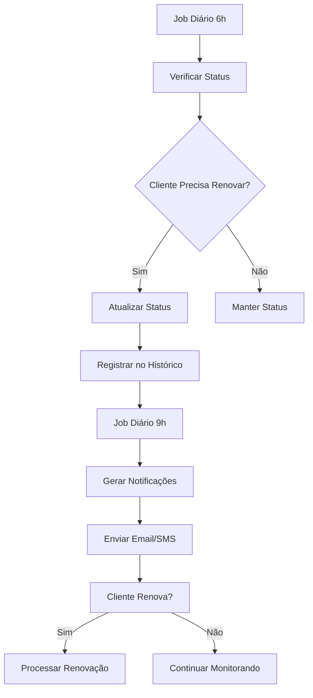
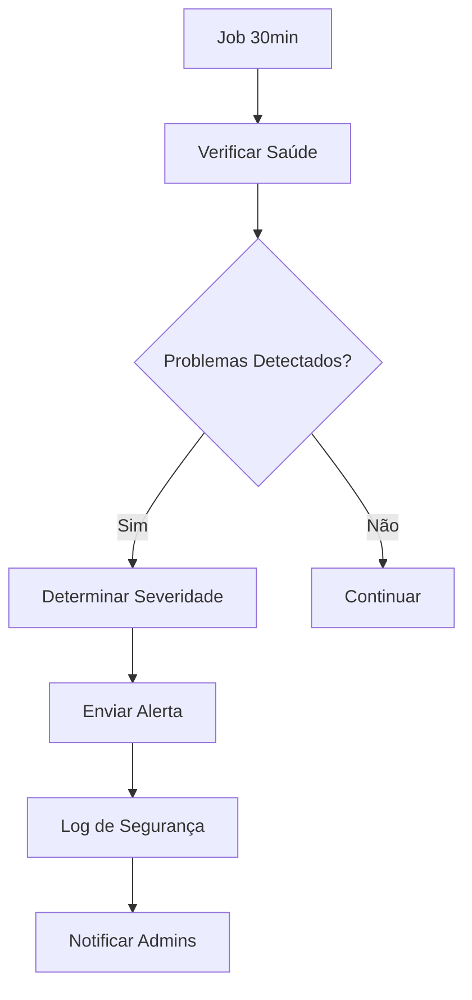

# Sistema de Automação e Lógica de Negócio - Nuvelon

## Visão Geral

O sistema de automação e lógica de negócio do Nuvelon foi projetado para automatizar processos críticos, gerenciar o ciclo de vida dos clientes e fornecer insights valiosos para tomada de decisões.

## Componentes Principais

### 1. Sistema de Agendamento de Jobs

#### Job Scheduler
- **`lib/automation/job-scheduler.ts`**: Sistema central de agendamento
  - Agendamento baseado em cron expressions
  - Monitoramento de execução e erros
  - Execução manual de jobs
  - Controle de habilitar/desabilitar jobs

#### Jobs Agendados
1. **Atualização de Status dos Clientes** (Diário às 6h)
   - Verifica clientes próximos do vencimento
   - Atualiza status automaticamente
   - Registra mudanças no histórico

2. **Notificações de Renovação** (Diário às 9h)
   - Gera notificações para clientes
   - Envia emails e SMS
   - Diferentes níveis de urgência

3. **Backup de Dados** (Semanal aos domingos às 2h)
   - Backup automático do banco
   - Logs de segurança
   - Verificação de integridade

4. **Limpeza de Logs** (Mensal no primeiro dia às 3h)
   - Remove logs antigos
   - Otimiza performance
   - Mantém histórico relevante

5. **Relatório Semanal** (Segundas às 8h)
   - Estatísticas de clientes
   - Receita mensal
   - Envio para administradores

6. **Verificação de Saúde** (A cada 30 minutos)
   - Monitora saúde do sistema
   - Detecta problemas
   - Envia alertas automáticos

### 2. Lógica de Negócio

#### Client Business Logic
- **`lib/business/client-business-logic.ts`**: Lógica central de clientes
  - Gerenciamento de status
  - Renovação de planos
  - Cancelamento e suspensão
  - Estatísticas e relatórios

#### Funcionalidades Principais

##### Atualização Automática de Status
```typescript
// Verifica clientes e atualiza status baseado na data de renovação
const updates = await clientBusinessLogic.updateClientStatuses()
```

##### Renovação de Clientes
```typescript
// Renova cliente com novo plano
const client = await clientBusinessLogic.renewClient(
  clientId, 
  planId, 
  userId
)
```

##### Geração de Notificações
```typescript
// Gera notificações para clientes próximos do vencimento
const notifications = await clientBusinessLogic.generateRenewalNotifications()
```

### 3. Sistema de Notificações

#### Notification Service
- **`lib/automation/notification-service.ts`**: Sistema completo de notificações
  - Emails personalizados com HTML
  - SMS para urgências
  - Alertas para administradores
  - Histórico de notificações

#### Tipos de Notificação

##### Notificações de Renovação
- **7 dias antes**: Lembrete amigável
- **3 dias antes**: Atenção
- **1 dia antes**: Importante
- **Vencido**: Urgente

##### Alertas do Sistema
- **Baixo**: Informações gerais
- **Médio**: Avisos importantes
- **Alto**: Problemas críticos
- **Crítico**: Falhas do sistema

### 4. APIs de Automação

#### Gerenciamento de Jobs
- **`GET /api/automation/jobs`**: Lista todos os jobs
- **`POST /api/automation/jobs`**: Executa job manualmente
- **`PUT /api/automation/jobs`**: Habilita/desabilita job

#### Estatísticas de Clientes
- **`GET /api/clients/statistics`**: Estatísticas em tempo real

#### Ações de Clientes
- **`POST /api/clients/[id]/actions?action=renew`**: Renovar cliente
- **`POST /api/clients/[id]/actions?action=cancel`**: Cancelar cliente
- **`POST /api/clients/[id]/actions?action=suspend`**: Suspender cliente
- **`POST /api/clients/[id]/actions?action=reactivate`**: Reativar cliente

## Fluxos de Automação

### 1. Fluxo de Renovação



### 2. Fluxo de Monitoramento



## Configuração de Jobs

### Cron Expressions

```typescript
// Diário às 6h
'0 6 * * *'

// Diário às 9h
'0 9 * * *'

// Semanal aos domingos às 2h
'0 2 * * 0'

// Mensal no primeiro dia às 3h
'0 3 1 * *'

// Semanal às segundas às 8h
'0 8 * * 1'

// A cada 30 minutos
'*/30 * * * *'
```

### Configuração de Jobs

```typescript
export const jobConfig = {
  id: 'job-id',
  name: 'Nome do Job',
  schedule: '0 6 * * *',
  enabled: true,
  errorCount: 0,
  maxErrors: 3,
  handler: async () => {
    // Lógica do job
  }
}
```

## Monitoramento e Logs

### Eventos Monitorados

1. **Execução de Jobs**
   - Início e fim de execução
   - Tempo de execução
   - Erros e exceções

2. **Mudanças de Status**
   - Alterações automáticas
   - Alterações manuais
   - Motivos das mudanças

3. **Notificações**
   - Envio de emails
   - Envio de SMS
   - Falhas de entrega

4. **Ações de Clientes**
   - Renovações
   - Cancelamentos
   - Suspensões
   - Reativações

### Consulta de Logs

```typescript
// Logs de segurança
const events = securityLogger.getRecentEvents(100)

// Logs de jobs
const jobEvents = securityLogger.getEventsByType('JOB_FAILED')

// Logs de clientes
const clientEvents = securityLogger.getEventsByType('CLIENT_RENEWED')
```

## Interface de Usuário

### Jobs Monitor
- **Visualização em tempo real** dos jobs
- **Controle de habilitar/desabilitar**
- **Execução manual** de jobs
- **Status detalhado** com erros e próximas execuções

### Dashboard de Automação
- **Estatísticas** de execução
- **Alertas** em tempo real
- **Histórico** de jobs
- **Configurações** de automação

## Variáveis de Ambiente

```env
# Emails dos administradores (separados por vírgula)
ADMIN_EMAILS=admin@nuvelon.com,manager@nuvelon.com

# Configurações de timezone
TZ=America/Sao_Paulo

# Configurações de backup
BACKUP_ENABLED=true
BACKUP_RETENTION_DAYS=30

# Configurações de notificação
EMAIL_ENABLED=true
SMS_ENABLED=true
```

## Boas Práticas

### 1. Jobs
- Sempre implementar tratamento de erros
- Usar timeouts apropriados
- Logar início e fim de execução
- Implementar retry logic para falhas temporárias

### 2. Notificações
- Usar templates personalizados
- Implementar rate limiting
- Verificar entrega
- Manter histórico de envios

### 3. Lógica de Negócio
- Validar dados antes de processar
- Implementar transações quando necessário
- Logar todas as ações importantes
- Manter consistência de dados

### 4. Monitoramento
- Configurar alertas apropriados
- Monitorar performance
- Implementar health checks
- Manter logs organizados

## Troubleshooting

### Problemas Comuns

1. **Job não executa**
   - Verificar se está habilitado
   - Verificar cron expression
   - Verificar logs de erro
   - Verificar timezone

2. **Notificações não chegam**
   - Verificar configuração de email/SMS
   - Verificar rate limiting
   - Verificar logs de entrega
   - Verificar dados do cliente

3. **Status não atualiza**
   - Verificar job de atualização
   - Verificar dados de renovação
   - Verificar logs de execução
   - Verificar permissões

### Debug

```typescript
// Verificar status dos jobs
const jobs = getScheduledJobsStatus()
console.log('Jobs status:', jobs)

// Executar job manualmente
await runScheduledJob('job-id')

// Verificar logs recentes
const logs = securityLogger.getRecentEvents(50)
console.log('Recent logs:', logs)
```

## Próximos Passos

1. **Integração com serviços externos**
   - SendGrid para emails
   - Twilio para SMS
   - AWS S3 para backup

2. **Dashboard avançado**
   - Gráficos de performance
   - Métricas em tempo real
   - Alertas personalizados

3. **Automação avançada**
   - Machine learning para previsões
   - Automação de marketing
   - Integração com CRM 